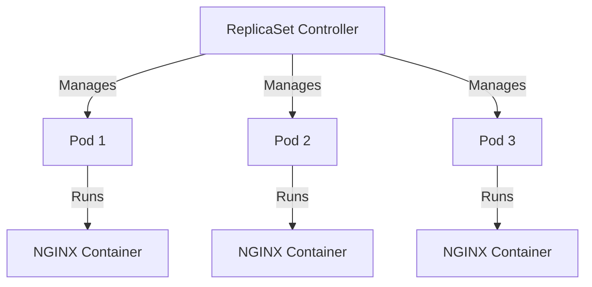

# 🚀 Kubernetes ReplicaSet Implementation

[](https://github.com/TheToriqul/k8s-replicaset)


## 📋 Project Overview

This project demonstrates the implementation of a Kubernetes ReplicaSet to manage and maintain a specified number of NGINX pod replicas. Through this implementation, I've showcased the power of Kubernetes' self-healing capabilities and automated pod management, ensuring high availability and reliability in containerized environments.

## 🎯 Key Objectives

- Deploy and manage a ReplicaSet in Kubernetes to maintain multiple NGINX pod replicas
- Implement self-healing mechanisms using Kubernetes' automated pod regeneration
- Configure proper pod labeling and selector matching for effective replica management
- Demonstrate pod lifecycle management and automatic recovery scenarios
- Practice industry-standard deployment configurations and best practices

## 🏗️ Project Architecture
The architecture illustrates a Kubernetes ReplicaSet Controller managing three identical pods. Each pod runs an NGINX container, with the ReplicaSet ensuring exactly three replicas are maintained at all times. The controller continuously monitors these pods and automatically replaces any that fail or are deleted, maintaining the desired state of three running NGINX instances.


## 💻 Technical Stack

- **Container Orchestration**: Kubernetes
- **Container Runtime**: Docker
- **Web Server**: NGINX
- **Container Image**: nginx:latest
- **Infrastructure**: Kubernetes Cluster
- **Configuration**: YAML

## 🚀 Getting Started

<details>
<summary>🐳 Prerequisites</summary>

- Kubernetes cluster (local or cloud-based)
- kubectl CLI tool installed and configured
- Basic understanding of Kubernetes concepts
- Docker installed (for local development)
- vim text editor (optional)

</details>

<details>
<summary>⚙️ Installation</summary>

1. Clone the repository:
   ```bash
   git clone https://github.com/TheToriqul/k8s-replicaset.git
   ```
2. Navigate to the project directory:
   ```bash
   cd k8s-replicaset
   ```
3. Apply the ReplicaSet configuration:
   ```bash
   kubectl apply -f replicaset.yaml
   ```

</details>

<details>
<summary>🎮 Usage</summary>

1. Deploy the ReplicaSet:
   ```bash
   kubectl apply -f replicaset.yaml
   ```
2. Verify the deployment:
   ```bash
   kubectl get replicasets
   kubectl get pods --selector=app=nginx
   ```

For detailed commands and testing scenarios, refer to the [reference-commands.md](reference-commands.md) file.

</details>

## 💡 Key Learnings

### Technical Mastery:

1. Advanced understanding of Kubernetes ReplicaSet controllers
2. Pod lifecycle management and automatic recovery mechanisms
3. Label-based pod selection and management
4. YAML-based Kubernetes configuration
5. Container orchestration best practices

### Professional Development:

1. Infrastructure automation and self-healing systems
2. High availability design patterns
3. Container management strategies
4. DevOps practices and tooling
5. System reliability engineering principles

### 🔄 Future Enhancements

<details>
<summary>View Planned Improvements</summary>

1. Implement rolling updates strategy
2. Add health check mechanisms
3. Configure resource limits and requests
4. Implement horizontal pod autoscaling
5. Add monitoring and logging solutions
6. Implement network policies
</details>

## 🙌 Contribution

Contributions are welcome! Feel free to [open an issue](https://github.com/TheToriqul/k8s-replicaset/issues) or submit a [pull request](https://github.com/TheToriqul/k8s-replicaset/pulls) to suggest improvements or add features.

## 📧 Connect with Me

- 📧 Email: toriqul.int@gmail.com
- 📱 Phone: +65 8936 7705, +8801765 939006
- 🌐 LinkedIn: [@TheToriqul](https://www.linkedin.com/in/thetoriqul/)
- 🐙 GitHub: [@TheToriqul](https://github.com/TheToriqul)
- 🌍 Portfolio: [TheToriqul.com](https://thetoriqul.com)

Let's connect and discuss cloud-native technologies!

## 👏 Acknowledgments

- [Poridhi for providing comprehensive labs and inspiring this project](https://devops.poridhi.io/)
- The Kubernetes community for excellent documentation and resources
- NGINX team for maintaining the official Docker image

---

Thank you for exploring this repository! I hope you find it valuable for understanding Kubernetes ReplicaSets and container orchestration concepts. Happy containerizing! 🚀